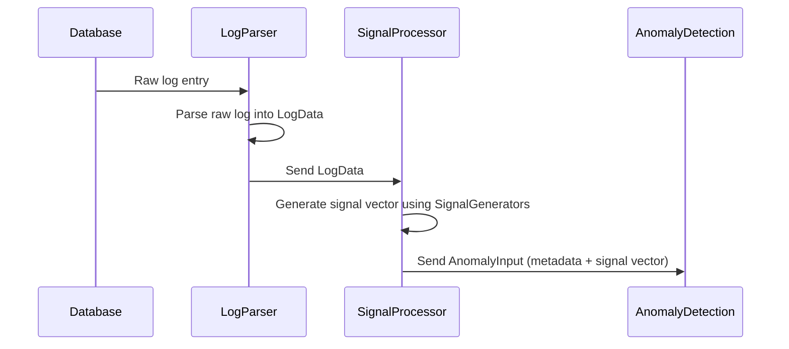

# LogSignalProcessor

A modular system for detecting anomalies in database logs, focusing on scenarios where a database might be compromised (e.g., encryption or tampering attempts).

## System Overview

LogSignalProcessor processes database logs, extracts meaningful signals, and prepares vectors for integration with third-party anomaly detection systems. The architecture supports multiple database types with implementations for Oracle and PostgreSQL.

### Key Components

The system comprises four main components:

1. **Database**: The origin of the logs (Oracle, PostgreSQL, etc.)
2. **Database Log Parser**: Converts raw database logs into a standardized format
3. **Log Processor**: Analyzes parsed log data to produce signal vectors
4. **Anomaly Detection** (Third-Party): Takes signal vectors as input to identify anomalies

### Data Flow

```mermaid
graph LR
    A[Database] -->|Raw Logs| B[Database Log Parser]
    B -->|Parsed Logs (LogData)| C[Log Processor]
    C -->|Signal Vector| D[Anomaly Detection System]
```

## Components

### 1. Database Log Parser (`dbparsers`)

Transforms raw database logs into a standardized `LogData` struct, ensuring downstream processing remains database-agnostic.

**Interface**: `LogParser` with the method `ParseLog(rawLog interface{}) (logprocessor.LogData, error)`

**Implementations**:
- `OracleLogParser`: Handles Oracle-specific log formats
- `PostgresLogParser`: Handles PostgreSQL-specific log formats

The `LogData` struct includes fields such as:
- Operation
- Table
- RowIdentifier
- Columns
- Timestamp
- Before
- After

### 2. Log Processor (`logprocessor`)

The core of the system, responsible for generating signals from parsed log data.

**Key Components**:
- `LogData`: Standardizes parsed log entries
- `SignalGenerator`: Interface for computing individual signals via `GenerateSignal(logData LogData) float64`
- `SignalProcessor`: Manages multiple signal generators and produces signal vectors
- `AnomalyInput`: Combines signal vectors with metadata for the anomaly detection system

#### Signal Generation

Each `SignalGenerator` computes a single signal value from a `LogData` instance:

- `FieldLevenshteinGenerator`: Calculates the Levenshtein distance between Before and After values
- `EntropyChangeGenerator`: Computes the difference in Shannon entropy between Before and After values

In discrete mathematical terms, a signal generator is a function:
f: LogData → R

The `SignalProcessor` aggregates multiple signal generators to produce a vector:
v = [f₁(logData), f₂(logData), …, fₙ(logData)]

#### Sequence Diagram



### 3. Log Simulator (`logsimulator`)

Generates mock database logs for testing purposes.

**Features**:
- `FieldConfig`: Specifies field names and data generators
- `GenerateLogs`: Produces mock log entries with custom fields
- `GenerateDefaultLogs`: Uses predefined fields for quick testing

## Testing Setup

The testing setup utilizes the log simulator to create mock logs, which are then processed by the log parser and signal processor.

**Process**:
1. Generate Mock Logs
2. Parse Logs
3. Generate Signals
4. Create AnomalyInput
5. Output (to console in testing, to anomaly detection in production)

## Usage

```
 go build -o log-processor
 ./log-processor
```